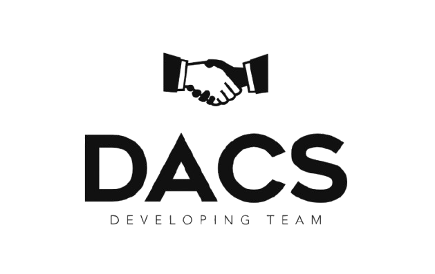

  

<h1 align="center">🌐 DACS - Your Gateway to AI Faculty</h1>

<em>Understand. Choose. Succeed.</em>

  
  
  

---

## 📑 Table of Contents
- [👋 Welcome](#-welcome-to-dacs)
- [🔎 Explore the Four Majors](#-explore-the-four-majors)
- [💡 Why DACS?](#-why-dacs)
- [🔗 Visit the Website](#-visit-the-website)
- [🛡️ Made by](#️-made-by-fady-basem)

---

## 👋 Welcome to DACS!

Are you a new student in the Faculty of Artificial Intelligence and feeling overwhelmed by all the specializations?  
**DACS** is here to help you understand each field clearly and guide you toward the right choice for your future.

We designed this platform to provide:
- ✅ Simplified overviews
- ✅ Key concepts and skills in each field
- ✅ Helpful resources to get you started

Start strong, and choose your path with confidence.  
Let’s build your future in AI, Security, Data, and Development — together.

---

## 🔎 Explore the Four Majors

### 🔐 Cyber Security
> **Protect the Digital World**  
> Learn ethical hacking, digital forensics, and how to secure systems from online threats.

---

### 📊 Data Science
> **Turn Data Into Insights**  
> Analyze massive datasets to uncover patterns and make data-driven decisions.

---

### 🤖 Artificial Intelligence
> **Build Intelligent Machines**  
> Learn machine learning, neural networks, and how to train models that mimic human intelligence.

---

### 💻 Software Development
> **Code the Future**  
> Develop applications, websites, and software systems with modern programming practices.

---

## 💡 Why DACS?

- 🧠 Covers **all four key majors** of the AI faculty
- 🧭 Designed specifically for **new students**
- 📚 Offers **clear, beginner-friendly explanations**
- 🎓 Helps you **understand and decide** on your best-fit specialization

---

## 🔗 Visit the Website

Check out the full project here:  
👉 [https://fodenbasem.github.io/DACS]([https://fodenbasem.github.io/DACS](https://fodenbasem.github.io/DACS/Welcomepage.html))

---

## 🛡️ Made by Fady Basem

  Made with ❤️ by <strong>Fady Basem - ( SilentN0va ) </strong> 
  Helping students find clarity in the world of AI and beyond 🌟  
  <a href="https://fodenbasem.github.io/DACS/Welcomepage.html">🌐 Visit DACS Now ↗</a>

